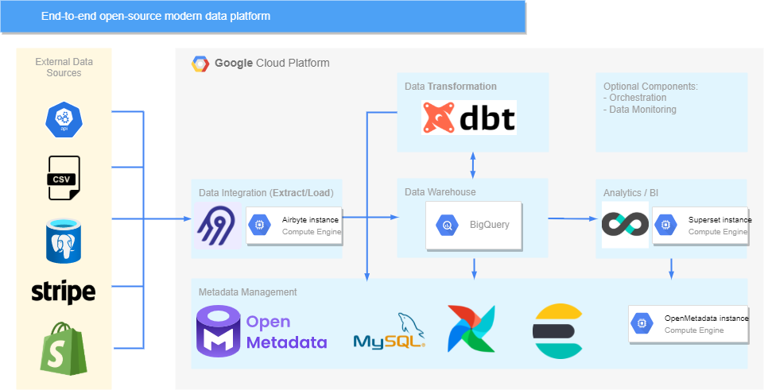

# Sample Modern Data Platform

This repository contains the different IaC scripts to deploy a sample Modern Data Platform, accompanied with a sample dbt model.

Please refer to [the main article](https://towardsdatascience.com/building-an-end-to-end-open-source-modern-data-platform-c906be2f31bd) that goes through the details of the platform and the reasoning behind the component choices.

The architecutre contains the following components:

* BigQuery
* Airbyte
* dbt
* Apache Superset
* OpenMetadata

## Architecture diagram

